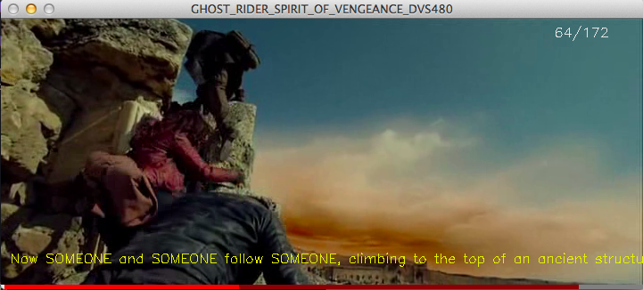

# Movie Dataset Video Annotator

## General Description

This tool was created to fine grain the Montreal Video Annotation
Dataset (M-VAD) and the MPII Movie Dataset, as the captions for each
video usually only describe one portion of the video. 

The final purpose of this tool is to generate fine grained data that
should be helpful for training systems for media action recognition
and video captioning.

The results are stored in a MySQL database for analysis convenience.

## Controls

The keyboard controls for the video annotation tool are:
    
    Space  - Play / Pause
    
    N      - Step backwards
    M      - Step forward
    .      - Annotate
    X      - Start point @ current frame
    C      - End point   @ current frame
    S      - Start point @ first frame
    F      - End point   @ last frame
    J      - Jump to next file
    H      - Show keyboard controls
    ESC, Q - Exit program
    
## Installation

This tool was implemented using Python 2.7 and OpenCV. Adrian
Rosebrock gives a good guide on how to install Python+OpenCV over
[here](http://www.pyimagesearch.com/2015/06/22/install-opencv-3-0-and-python-2-7-on-ubuntu/).

Afterwards, you will require to install the following Python
packages, for this you can use *pip install <package>*

- tkinter
- imageio
- moviepy
- sqlalchemy
- nltk

## Usage

The video annotator script is located under
Annotator/VideoAnnotator.py. In order to make it work first you need
to run it once, which will create an empty *videoannotator.ini* file which needs to be
filled up with the following information:

- Dataset
    - base_path (Directory that contains both dataset M-VAD and MPII)
- Database (Access info for annotation database)
    - db_ip 
    - db_username
    - db_password
    - db_name
- Annotation (deprecated)
- Capture 
    - output_dir (Directory where the exported GIF files will be stored)
